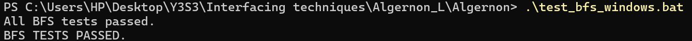
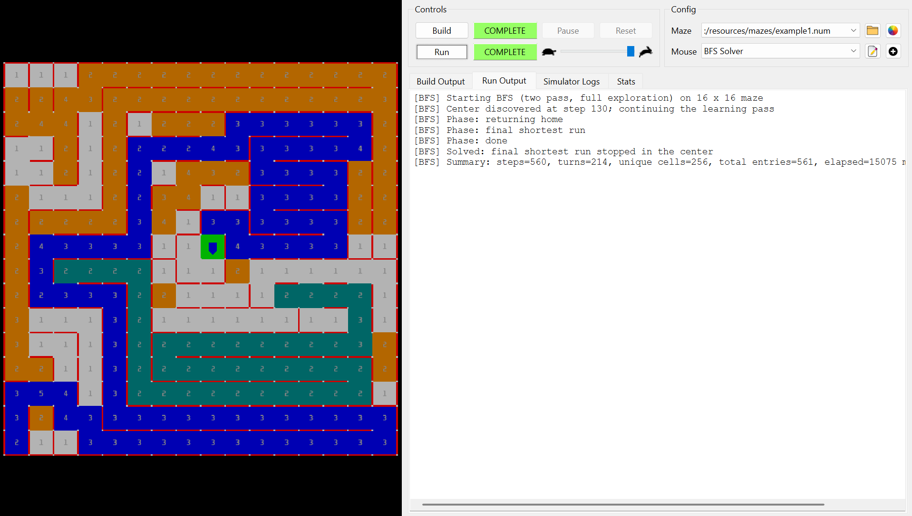
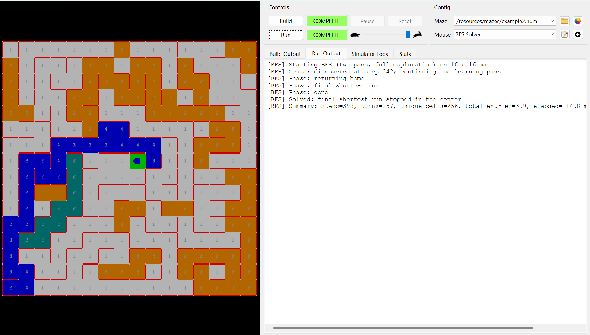
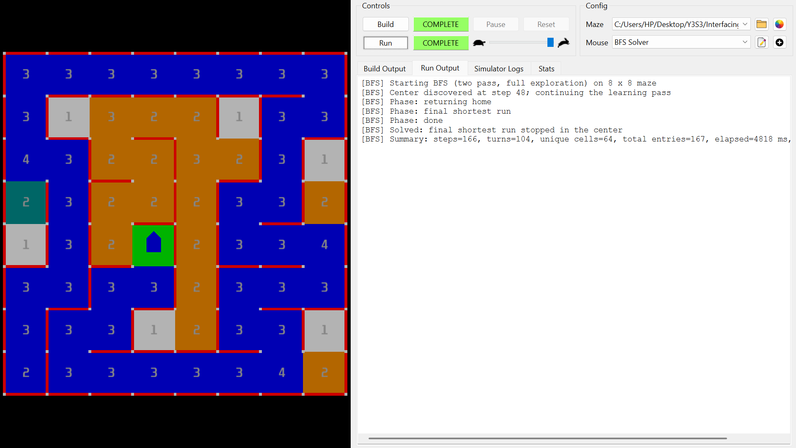
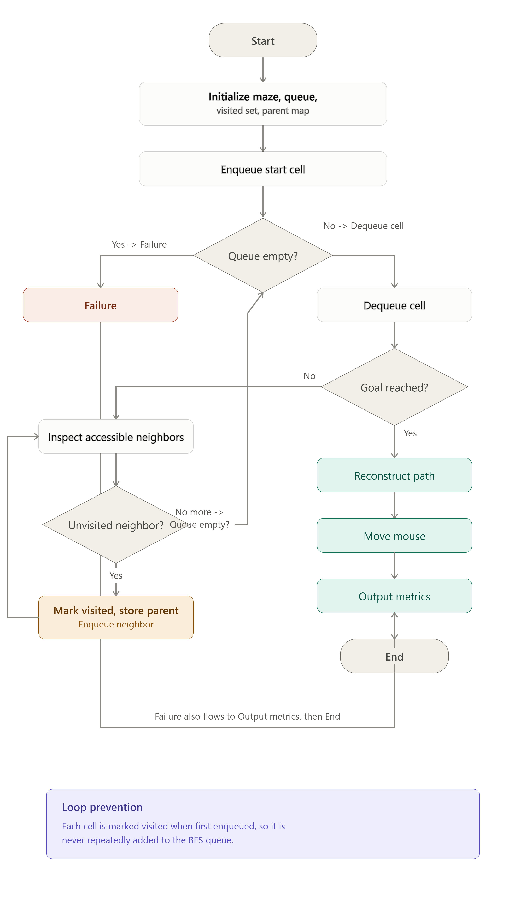

# BFS Task 1 — Added Work

## 1. Files added

### BFS implementation
- `src/main_bfs.cpp`
- `src/navigation/BfsSolver.h`
- `src/navigation/BfsSolver.cpp`
- `src/tracking/BfsRunMetrics.h`
- `src/tracking/BfsRunMetrics.cpp`

### BFS tests
- `tests/test_bfs.cpp`
- `test_bfs_windows.bat`

### BFS build support
- `build_bfs_windows.bat`

### Documentation and evidence
- `README_bfs.md`
- `BFS/` evidence folder
- BFS flowchart
- BFS result logs and CSV
- custom 8×8 maze file

## 2. Existing files reused

The BFS implementation reuses the existing project structure and shared components, including simulator I/O, maze/model types, `GoalDetector`, `VisitTracker`, and `API`. The wall-following implementation remains separate.

## 3. Why BFS

BFS was used because the maze can be treated as an unweighted grid graph, where each valid cell-to-cell move has equal cost. Once the relevant maze connectivity is learned, BFS returns a minimum-move path in that known graph. The solver therefore learns walls first and never assumes that an unknown edge is open.

## 4. Makefile changes

Added BFS targets:

```bash
make bfs
make bfs-test
```

`make clean` was also updated to remove BFS binaries.

## 5. BFS behavior

The implemented BFS solver learns walls while moving. Each cell stores wall states as `UNKNOWN`, `OPEN`, or `WALL`, and discovered edges are recorded consistently for adjacent cells. During learning, BFS is used to reach the nearest accessible frontier through known-open edges; for return and final routing, BFS reconstructs a path using stored parent cells/directions. The solver records moves, turns, unique cells, total cell entries, elapsed time, and final position. It also includes safe no-path handling, a maximum-step safety stop, and simulator-reset detection.

The BFS solver supports three exploration modes: `FULL_MAZE`, `UNTIL_FIRST_GOAL`, and `SINGLE_PASS_TO_GOAL`. `FULL_MAZE` explores the complete reachable maze, returns to the start, then computes and executes the shortest known route to the center; `UNTIL_FIRST_GOAL` stops learning once the center is first reached, then returns home and runs the best route known so far; and `SINGLE_PASS_TO_GOAL` stops immediately on the first center arrival without a return or final run. For the reported results, `FULL_MAZE` was chosen because it provides the most complete learned map and therefore gives the strongest basis for demonstrating BFS shortest-path behavior in the known maze.

## 6. BFS core logic

1. Initialize queue, visited set, and parent map.
2. Mark and enqueue the start cell.
3. Dequeue the next cell.
4. Check whether the target is reached.
5. Inspect accessible known-open neighbors.
6. For each unvisited neighbor, mark it visited, store its parent, and enqueue it.
7. Repeat until the target is reached or the queue becomes empty.
8. Reconstruct and reverse the path using stored parent information.

### Infinite-loop prevention

Each cell is marked visited when first enqueued, so it is not repeatedly added to the BFS queue through cycles. The search terminates when the target is reached or when the queue becomes empty.

## 7. Automated test result

Command:

```bat
test_bfs_windows.bat
```

Result:

```text
All BFS tests passed.
BFS TESTS PASSED.
```

The automated tests verify boundary safety, termination of all three modes, center arrival, internal/physical position agreement, full exploration in `FULL_MAZE`, and the expected return-home/single-pass behavior.



*Figure 1. Automated BFS tests completed successfully.*

## 8. MMS test results

All reported runs used `FULL_MAZE`.

| Maze | Size | Solved | Moves | Turns | Unique cells | Total entries | Time (ms) |
|---|---:|---:|---:|---:|---:|---:|---:|
| MMS example1 | 16×16 | Yes | 560 | 214 | 256 | 561 | 15075 |
| MMS example2 | 16×16 | Yes | 398 | 257 | 256 | 399 | 11498 |
| Custom BFS maze | 8×8 | Yes | 166 | 104 | 64 | 167 | 4818 |

### 16×16 example1



*Figure 2. BFS full-maze run on MMS example1. The solver explored the maze, returned to the start, executed the final BFS route, and stopped successfully in the center.*

### 16×16 example2



*Figure 3. BFS full-maze run on MMS example2. All 256 cells were visited before the final center run.*

### 8×8 custom maze



*Figure 4. BFS full-maze run on the custom 8×8 maze. All 64 cells were visited and the solver stopped successfully in the center.*

### Metric meaning

- **Moves:** executed cell-to-cell moves.
- **Turns:** recorded direction changes/turn-around actions.
- **Unique cells:** number of distinct cells visited.
- **Total entries:** total physical cell entries, including revisits.
- **Time:** elapsed simulator run time in milliseconds.

### MMS visualization

- light/gray: first learning visit
- orange: repeated learning visit
- cyan: return-home route
- blue: final shortest known route
- green: final center
- cell number: visit count

### Result summary

- Both 16×16 runs visited all **256 cells**.
- The 8×8 run visited all **64 cells**.
- All three runs finished successfully in the center.
- Example2 used fewer moves than example1 but more turns, showing that the current BFS cost is based on cell moves rather than turn minimization.

## 9. BFS flowchart



*Figure 5. BFS logic showing queue processing, goal detection, neighbor expansion, visited/parent tracking, path reconstruction, failure handling, and loop prevention.*

## 10. Claims to use in the report

- BFS returns a minimum-move path in the known unweighted graph.
- Full-maze mode learns the complete reachable maze before calculating the final route.
- The solver does not intentionally plan through unknown or known-wall edges.
- Visited marking prevents repeated BFS expansion through cycles.
- The BFS implementation was successfully tested on both 8×8 and 16×16 mazes.

Avoid claiming that the first physical exploration route is globally shortest in an unknown maze or that the implementation minimizes turns. Elapsed time should also not be overinterpreted unless simulator speed and computer conditions are kept the same; moves, turns, and visit counts are more reproducible comparison metrics.

> *CALL ME ACE*